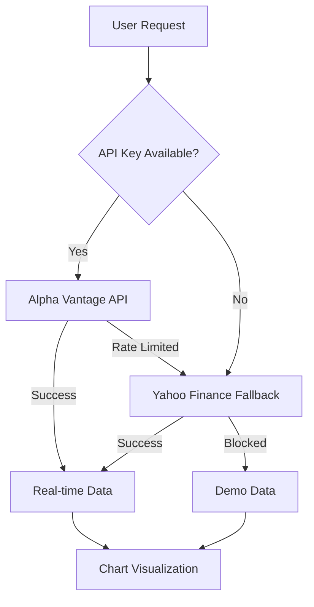

# 📊 StockCharts - Financial Dashboard Suite

> **A comprehensive financial data visualization platform featuring specialized dashboards for stocks, cryptocurrencies, forex, and market indices. Experience real-time data, interactive charts, and professional-grade analysis tools.**

<div align="center">

[](https://asleshsura.github.io/StockCharts)


</div>

## � Key Features

<table>
<tr>
<td width="50%">

### 📈 **Market Indices Dashboard**
- Real-time S&P 500, NASDAQ & Dow Jones tracking
- Live market status indicators
- Automatic 5-minute refresh cycles
- One-click chart visualization

### ₿ **Cryptocurrency Dashboard** 
- 24/7 crypto monitoring
- Major coins: BTC, ETH, BNB, XRP, ADA, DOT
- Real-time price & percentage changes
- Crypto-optimized volatility charts

</td>
<td width="50%">

### 💱 **Forex Trading Dashboard**
- 8 major currency pairs
- Interactive pair builder
- Currency swap functionality
- Live exchange rate tracking

### 📊 **Stock Analysis Tools**
- Individual stock research
- Side-by-side comparisons
- Multiple time ranges (7D to 1Y)
- Export capabilities (PNG/CSV)

</td>
</tr>
</table>

---

## 🎯 Quick Start

### 🌐 **Instant Access** 
Visit **[StockCharts Live Demo](https://asleshsura.github.io/StockCharts)** - No installation required!

### 💻 **Local Development**
```bash
# Clone the repository
git clone https://github.com/AsleshSura/StockCharts.git
cd StockCharts

# Open in browser (choose your preferred method)
start index.html                    # Windows
open index.html                     # macOS  
xdg-open index.html                 # Linux

# Or use a local server
python -m http.server 8000          # Python
npx serve .                         # Node.js
```

### 🔑 **API Setup (Optional)**
1. Get your free API key from [Alpha Vantage](https://www.alphavantage.co/support/#api-key)
2. Enter the key in any dashboard for real-time data
3. Without API key: Demo mode with sample data automatically loads

---
## 🏗️ Architecture & Dashboard Overview

### 🎯 **Dashboard Hub** (`navigation.html`)
Central navigation portal providing access to all specialized financial dashboards with modern card-based interface.

### 📱 **Dashboard Collection**

| Dashboard | File | Purpose | Key Features |
|-----------|------|---------|--------------|
| 🏠 **Navigation Hub** | `navigation.html` | Dashboard selector | Modern UI, quick access |
| 📈 **Market Indices** | `market-indices.html` | S&P 500, NASDAQ, Dow | Live tracking, market status |
| ₿ **Cryptocurrency** | `cryptocurrency.html` | Major crypto assets | 24/7 monitoring, volatility charts |
| 💱 **Forex Trading** | `forex.html` | Currency pairs | Real-time rates, pair builder |
| 📊 **Stock Analysis** | `stock-analysis.html` | Individual stocks | Deep analysis, company data |
| ⚖️ **Stock Comparison** | `stock-comparison.html` | Side-by-side analysis | Dual charts, performance comparison |
| 🎯 **All-in-One** | `index.html` | Combined interface | Original unified dashboard |

---

## 🛠️ Technical Stack

<div align="center">

| **Frontend** | **Charts** | **APIs** | **Styling** |
|-------------|------------|----------|-------------|
| Vanilla JavaScript ES6+ | Chart.js 4.0+ | Alpha Vantage | Modern CSS3 |
| HTML5 Semantic | Interactive Tooltips | Yahoo Finance | CSS Custom Properties |
| Progressive Enhancement | Responsive Charts | Demo Data Fallback | Glassmorphism Design |

</div>

### 🎨 **Design Features**
- **🌙 Dark/Light Mode** - Automatic theme switching with persistence
- **📱 Responsive Design** - Mobile-first approach, works on all devices  
- **✨ Smooth Animations** - Professional transitions and micro-interactions
- **♿ Accessibility** - Keyboard navigation, ARIA labels, color contrast
- **🚀 Performance** - Lazy loading, debounced API calls, efficient DOM manipulation

---

## � Data Sources & Integration

### 🔄 **Multi-Tier Data Strategy**



| **Source** | **Type** | **Features** | **Limitations** |
|------------|----------|--------------|-----------------|
| **Alpha Vantage** | Primary API | Real-time, comprehensive | 5 calls/min (free) |
| **Yahoo Finance** | Fallback API | No key required, reliable | CORS restrictions |
| **Demo Data** | Local fallback | Always available, testing | Static sample data |

### 📈 **Data Types Supported**
- **Stocks**: Real-time quotes, historical data, OHLC values
- **Cryptocurrencies**: 24/7 pricing, major coin support  
- **Forex**: Live exchange rates, 8 major currencies
- **Market Indices**: S&P 500, NASDAQ, Dow Jones tracking

---

## 🚀 Usage Guide

### 🎯 **Getting Started**

1. **🏠 Choose Your Dashboard**: Start at `navigation.html` to select your preferred financial focus
2. **🔍 Enter Symbols**: Input stock symbols (AAPL, TSLA), crypto pairs (BTC-USD, ETH-USD), or forex pairs (EUR/USD)
3. **📅 Select Timeframe**: Choose from 7 days, 30 days, 90 days, or 1 year
4. **📊 Analyze Data**: Interactive charts with hover tooltips and detailed information

### 📈 **Market Indices Dashboard**
```bash
# Supported Indices
S&P 500 (SPY)     # Broad market performance
NASDAQ (QQQ)      # Technology focus  
Dow Jones (DIA)   # Blue-chip stocks
```
- **Live Tracking**: Auto-refresh every 5 minutes
- **Market Status**: Real-time open/closed indicators
- **Quick Charts**: One-click chart viewing

### ₿ **Cryptocurrency Dashboard**  
```bash
# Major Cryptocurrencies Supported
BTC-USD    # Bitcoin
ETH-USD    # Ethereum  
BNB-USD    # Binance Coin
XRP-USD    # Ripple
ADA-USD    # Cardano
DOT-USD    # Polkadot
```
- **24/7 Monitoring**: Continuous price tracking
- **Volatility Charts**: Crypto-optimized visualizations
- **Live Updates**: Real-time price and percentage changes

### 💱 **Forex Dashboard**
```bash
# Currency Pairs Available
EUR/USD, GBP/USD, USD/JPY, USD/CHF
USD/CAD, AUD/USD, NZD/USD, EUR/GBP
```
- **Interactive Builder**: Create custom currency pairs
- **Swap Function**: Quick rate inversions (EUR/USD ↔ USD/EUR)
- **Live Rates**: Real-time exchange rate updates

### 📊 **Stock Analysis & Comparison**
- **Individual Analysis**: Detailed stock research with company information
- **Side-by-Side Comparison**: Compare two stocks with synchronized timeframes
- **Export Options**: Download charts (PNG) and data (CSV)
- **OHLC Data**: Complete open, high, low, close, and volume information

### 🎨 **Theme & Customization**
- **Theme Toggle**: Click 🌙/☀️ icon to switch between dark/light modes
- **Persistent Settings**: Your preferences are automatically saved
- **Responsive Design**: Optimized for desktop, tablet, and mobile

---

## 💾 Export & Download Features

### 📥 **Export Capabilities**

| **Export Type** | **Format** | **Content** | **Use Case** |
|-----------------|------------|-------------|--------------|
| Chart Image | PNG | High-quality chart visualization | Presentations, reports |
| Stock Data | CSV | OHLC data with volume | Analysis, spreadsheets |
| Comparison Charts | PNG | Side-by-side chart images | Comparative analysis |
| Comparison Data | CSV | Dual stock OHLC datasets | Advanced analysis |

### 🔧 **Export Features**
- **Smart Naming**: Files include stock symbol and current date
- **High Quality**: 1600x600px for comparisons, full resolution for singles  
- **Instant Download**: No configuration needed, downloads start immediately
- **Cross-Browser**: Works on Chrome, Firefox, Safari, Edge

---

## 🏗️ Project Structure

```
StockCharts/
├── 🏠 navigation.html          # Central dashboard hub
├── 📊 index.html               # All-in-one dashboard  
├── 📈 market-indices.html      # S&P 500, NASDAQ, Dow tracking
├── ₿ cryptocurrency.html       # Crypto monitoring dashboard
├── 💱 forex.html               # Currency trading dashboard  
├── 📊 stock-analysis.html      # Individual stock research
├── ⚖️ stock-comparison.html    # Side-by-side stock comparison
├── 
├── 🎨 Styling & Assets
│   ├── style.css               # Main stylesheet with themes
│   └── navigation.css          # Navigation-specific styles
├── 
├── ⚙️ JavaScript Core
│   ├── script.js               # Main application logic
│   └── utils.js                # Utility functions & theme management
├── 
└── 📖 Documentation
    └── README.md               # This comprehensive guide
```

### 🧩 **Component Architecture**

| **Component** | **Responsibility** | **Key Features** |
|---------------|-------------------|------------------|
| **Navigation Hub** | Dashboard routing | Modern card interface, theme persistence |
| **Chart Engine** | Data visualization | Chart.js integration, responsive design |
| **API Manager** | Data fetching | Multi-source fallback, error handling |
| **Theme System** | UI appearance | Dark/light modes, smooth transitions |
| **Export Engine** | Data export | PNG/CSV generation, smart naming |

---

## 🌐 Browser Compatibility

<div align="center">

| Browser | Version | Status | Notes |
|---------|---------|--------|-------|
| **Chrome** | 80+ | ✅ Full Support | Recommended |
| **Firefox** | 75+ | ✅ Full Support | All features working |
| **Safari** | 13+ | ✅ Full Support | iOS/macOS compatible |
| **Edge** | 80+ | ✅ Full Support | Chromium-based |

</div>

### 📱 **Device Support**
- **Desktop**: Full feature set, optimal experience
- **Tablet**: Touch-optimized, responsive charts  
- **Mobile**: Mobile-first design, swipe navigation
- **PWA Ready**: Can be installed as app on mobile devices

---

## ⚡ Performance Features

### 🚀 **Optimization Strategies**
- **Lazy Loading**: Chart libraries loaded on demand
- **Debounced API Calls**: Prevents rate limiting and excessive requests
- **Memory Management**: Proper chart cleanup and resource disposal  
- **Efficient DOM**: Minimal reflows and optimized updates
- **Caching Strategy**: Local storage for themes and preferences

### 📊 **Performance Metrics**
- **Initial Load**: < 2 seconds on 3G connection
- **Chart Rendering**: < 500ms for most datasets
- **API Response**: < 1 second with fallback strategy
- **Theme Switching**: < 200ms smooth transition

---

## 🤝 Contributing

We welcome contributions! Here's how you can help improve StockCharts:

### 🛠️ **Development Setup**
```bash
# Fork and clone the repository
git clone https://github.com/yourusername/StockCharts.git
cd StockCharts

# Create a feature branch
git checkout -b feature/amazing-feature

# Make your changes and test thoroughly
# Commit with descriptive messages
git commit -m "Add: Enhanced crypto dashboard with new features"

# Push and create a Pull Request
git push origin feature/amazing-feature
```

### 🎯 **Contribution Areas**
- **📊 New Chart Types**: Candlestick, technical indicators
- **🔌 API Integrations**: Additional data sources  
- **🎨 UI/UX Improvements**: Design enhancements
- **📱 Mobile Features**: PWA capabilities
- **🧪 Testing**: Unit tests, integration tests
- **📖 Documentation**: Tutorials, API docs

### 📋 **Pull Request Guidelines**
1. **Clear Description**: Explain what changes you made and why
2. **Test Coverage**: Ensure your changes work across browsers
3. **Code Style**: Follow existing patterns and conventions  
4. **Documentation**: Update README if adding new features
5. **Performance**: Consider impact on load times and responsiveness

---

## 🗺️ Roadmap & Future Features

### 🎯 **Planned Enhancements**

| **Feature** | **Priority** | **Status** | **Description** |
|-------------|--------------|------------|-----------------|
| Technical Indicators | High | 🔄 In Progress | Moving averages, RSI, MACD |
| Portfolio Tracking | High | 📋 Planned | Personal portfolio management |
| Price Alerts | Medium | 📋 Planned | Email/SMS notifications |
| News Integration | Medium | 📋 Planned | Financial news feeds |
| Advanced Charts | Medium | 📋 Planned | Candlestick patterns |
| Watchlists | Low | 💭 Considering | Custom stock lists |
| Mobile App | Low | 💭 Considering | Native mobile version |

### ✅ **Recently Completed**
- ✅ **Export Functionality**: PNG and CSV downloads
- ✅ **Multi-Dashboard Architecture**: Specialized dashboards
- ✅ **Cryptocurrency Support**: Major coin tracking
- ✅ **Forex Integration**: Currency pair analysis
- ✅ **Theme System**: Dark/light mode switching

---

## 📄 License

<div align="center">

**MIT License** - Feel free to use, modify, and distribute

[](https://opensource.org/licenses/MIT)

</div>

This project is open source and available under the [MIT License](LICENSE). You're free to use it for personal or commercial projects.

---

## 🙏 Acknowledgments & Credits

### 🛠️ **Built With**
- **[Chart.js](https://www.chartjs.org/)** - Powerful, flexible charting library
- **[Alpha Vantage](https://www.alphavantage.co/)** - Comprehensive financial data API
- **[Yahoo Finance](https://finance.yahoo.com/)** - Reliable backup data source
- **[Date-fns](https://date-fns.org/)** - Modern date utility library

### 🎨 **Design Inspiration**  
- **Modern CSS Techniques** - Glassmorphism, fluid animations
- **Financial UI Patterns** - Professional trading interfaces
- **Accessibility Guidelines** - WCAG 2.1 compliance standards

### 🌟 **Special Thanks**
- Contributors and beta testers
- Open source community
- Financial data providers
- UI/UX design community

---

## 📞 Support & Contact

### 🆘 **Getting Help**

| **Issue Type** | **Contact Method** | **Response Time** |
|----------------|-------------------|-------------------|
| **🐛 Bug Reports** | [GitHub Issues](https://github.com/AsleshSura/StockCharts/issues) | 24-48 hours |
| **💡 Feature Requests** | [GitHub Discussions](https://github.com/AsleshSura/StockCharts/discussions) | 2-3 days |
| **❓ General Questions** | Email or GitHub Issues | 1-2 days |

### 🔧 **Troubleshooting**

<details>
<summary><strong>🚨 Common Issues</strong></summary>

**API Rate Limiting**
- Wait 60 seconds between requests on free tier
- Consider upgrading to paid Alpha Vantage plan
- Demo mode works without API limits

**Charts Not Loading**  
- Check internet connection
- Verify browser compatibility (Chrome 80+)
- Clear browser cache and cookies

**Export Not Working**
- Ensure pop-ups are allowed
- Check download folder permissions
- Try different browser if issues persist

</details>

---

<div align="center">

## 🚀 **Ready to Explore Financial Data?**

[](https://asleshsura.github.io/StockCharts)

**Made with ❤️ by [AsleshSura](https://github.com/AsleshSura)**

*Empowering financial analysis through beautiful, interactive data visualization*

---

⭐ **Star this repo if you found it helpful!** ⭐

</div>
