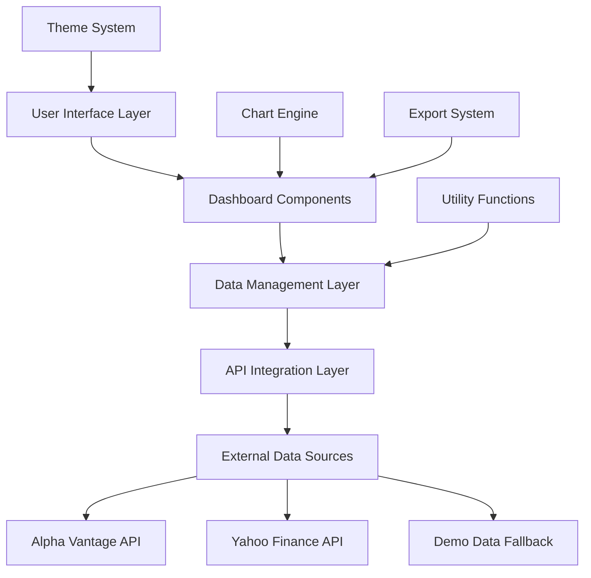
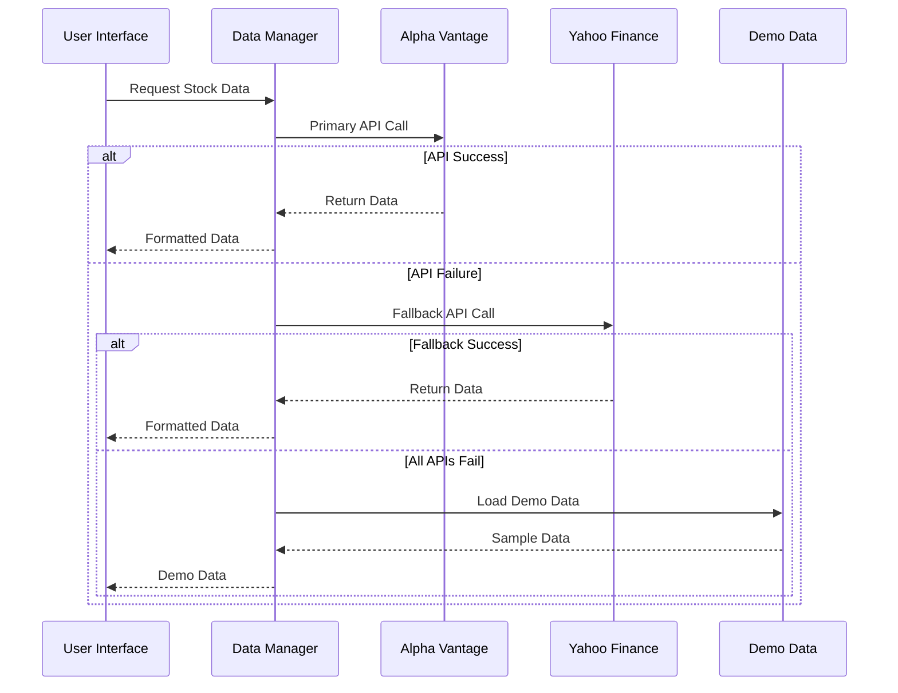

# 🏗️ Project Architecture

This document provides a comprehensive overview of the StockCharts architecture, design patterns, and technical decisions that make the platform robust, scalable, and maintainable.

## 🎯 Architecture Overview

StockCharts follows a **modular, component-based architecture** built with vanilla JavaScript and modern web standards. The system prioritizes simplicity, performance, and maintainability.



## 📁 Directory Structure

```
StockCharts/
├── 📱 User Interface
│   ├── navigation.html          # Dashboard hub and routing
│   ├── index.html               # Unified dashboard
│   ├── market-indices.html      # Market tracking dashboard
│   ├── cryptocurrency.html      # Crypto monitoring dashboard
│   ├── forex.html               # Currency trading dashboard
│   ├── stock-analysis.html      # Individual stock analysis
│   └── stock-comparison.html    # Comparative analysis
│
├── 🎨 Styling System
│   ├── style.css               # Core styles and theme variables
│   └── navigation.css          # Navigation-specific styles
│
├── ⚙️ JavaScript Core
│   ├── script.js               # Main application logic
│   └── utils.js                # Utility functions and theme management
│
├── 📖 Documentation
│   └── docs/                   # Comprehensive documentation
│
└── 🔧 Configuration
    ├── .gitignore             # Git ignore patterns
    └── README.md              # Project overview
```

## 🧩 Component Architecture

### 1. **User Interface Layer**

#### Navigation Hub (`navigation.html`)
- **Purpose**: Central dashboard routing and selection
- **Features**: Modern card-based interface, theme toggle
- **Dependencies**: `navigation.css`, `utils.js` (ThemeManager)

#### Specialized Dashboards
Each dashboard follows a consistent structure:

```html
<!DOCTYPE html>
<html data-theme="light">
<head>
    <!-- Meta and styling -->
</head>
<body>
    <div class="container">
        <header class="header">
            <!-- Navigation and theme toggle -->
        </header>
        <main class="content">
            <!-- Dashboard-specific UI -->
        </main>
    </div>
    <!-- Scripts -->
</body>
</html>
```

### 2. **Data Management Layer**

#### API Manager (`script.js`)
```javascript
// Core data fetching architecture
class DataManager {
    constructor() {
        this.apiKey = this.getStoredApiKey();
        this.fallbackSources = ['alphavantage', 'yahoo', 'demo'];
    }
    
    async fetchData(symbol, type) {
        for (const source of this.fallbackSources) {
            try {
                const data = await this.callAPI(source, symbol, type);
                if (data) return data;
            } catch (error) {
                console.warn(`${source} failed, trying next source`);
            }
        }
        return this.getDemoData(symbol, type);
    }
}
```

#### Data Flow Pattern


### 3. **Visualization Layer**

#### Chart Engine Integration
```javascript
// Chart.js configuration pattern
const chartConfig = {
    type: 'line',
    data: {
        labels: timestamps,
        datasets: [{
            label: symbol,
            data: prices,
            borderColor: getThemeColor('primary'),
            backgroundColor: getThemeColor('primaryTransparent')
        }]
    },
    options: {
        responsive: true,
        maintainAspectRatio: false,
        interaction: {
            intersect: false,
            mode: 'index'
        },
        plugins: {
            legend: {
                labels: {
                    color: getThemeColor('text')
                }
            }
        },
        scales: {
            x: {
                ticks: { color: getThemeColor('text') },
                grid: { color: getThemeColor('border') }
            },
            y: {
                ticks: { color: getThemeColor('text') },
                grid: { color: getThemeColor('border') }
            }
        }
    }
};
```

## 🎨 Theme System Architecture

### CSS Custom Properties Pattern
```css
:root[data-theme="light"] {
    --color-primary: #2563eb;
    --color-background: #ffffff;
    --color-surface: #f8fafc;
    --color-text: #1e293b;
    --color-border: #e2e8f0;
}

:root[data-theme="dark"] {
    --color-primary: #3b82f6;
    --color-background: #0f172a;
    --color-surface: #1e293b;
    --color-text: #f1f5f9;
    --color-border: #334155;
}
```

### Theme Manager Class
```javascript
class ThemeManager {
    constructor() {
        this.currentTheme = this.getStoredTheme() || 'light';
        this.observers = [];
    }
    
    toggleTheme() {
        this.currentTheme = this.currentTheme === 'light' ? 'dark' : 'light';
        this.applyTheme(this.currentTheme);
        this.notifyObservers();
    }
    
    applyTheme(theme) {
        document.documentElement.setAttribute('data-theme', theme);
        this.storeTheme(theme);
    }
    
    // Observer pattern for theme changes
    subscribe(callback) {
        this.observers.push(callback);
    }
    
    notifyObservers() {
        this.observers.forEach(callback => callback(this.currentTheme));
    }
}
```

## 🔄 Data Integration Patterns

### 1. **Multi-Source Fallback Strategy**

```javascript
const DATA_SOURCES = {
    primary: {
        name: 'Alpha Vantage',
        baseUrl: 'https://www.alphavantage.co/query',
        requiresKey: true,
        rateLimit: '5 calls/minute'
    },
    fallback: {
        name: 'Yahoo Finance',
        baseUrl: 'https://query1.finance.yahoo.com',
        requiresKey: false,
        corsProxy: 'https://api.allorigins.win/raw?url='
    },
    demo: {
        name: 'Demo Data',
        source: 'local',
        alwaysAvailable: true
    }
};
```

### 2. **Error Handling Strategy**

```javascript
async function fetchWithFallback(symbol, timeRange) {
    const errors = [];
    
    for (const source of DATA_SOURCES) {
        try {
            const data = await source.fetch(symbol, timeRange);
            if (validateData(data)) {
                return { data, source: source.name, success: true };
            }
        } catch (error) {
            errors.push({ source: source.name, error: error.message });
        }
    }
    
    return { 
        data: getDemoData(symbol), 
        source: 'demo', 
        success: false,
        errors 
    };
}
```

## 📊 Performance Architecture

### 1. **Lazy Loading Strategy**

```javascript
// Chart.js loaded on demand
async function loadChartJS() {
    if (window.Chart) return; // Already loaded
    
    return new Promise((resolve, reject) => {
        const script = document.createElement('script');
        script.src = 'https://cdn.jsdelivr.net/npm/chart.js';
        script.onload = resolve;
        script.onerror = reject;
        document.head.appendChild(script);
    });
}
```

### 2. **Debounced API Calls**

```javascript
function debounce(func, wait) {
    let timeout;
    return function executedFunction(...args) {
        const later = () => {
            clearTimeout(timeout);
            func(...args);
        };
        clearTimeout(timeout);
        timeout = setTimeout(later, wait);
    };
}

const debouncedSearch = debounce(searchStock, 300);
```

### 3. **Memory Management**

```javascript
function destroyChart() {
    if (window.currentChart) {
        window.currentChart.destroy();
        window.currentChart = null;
    }
}

function createChart(config) {
    destroyChart(); // Clean up previous chart
    window.currentChart = new Chart(ctx, config);
    return window.currentChart;
}
```

## 🔧 Module System

### Core Modules

#### 1. **API Module** (`script.js`)
- **Responsibilities**: Data fetching, API management, error handling
- **Exports**: `fetchStockData()`, `fetchCryptoData()`, `getApiKey()`
- **Dependencies**: External APIs, localStorage

#### 2. **Theme Module** (`utils.js`)
- **Responsibilities**: Theme management, UI state persistence
- **Exports**: `ThemeManager` class
- **Dependencies**: localStorage, DOM API

#### 3. **Chart Module** (Distributed)
- **Responsibilities**: Chart creation, configuration, export
- **Location**: Embedded in each dashboard
- **Dependencies**: Chart.js, Theme Module

#### 4. **Export Module** (Distributed)
- **Responsibilities**: Data and chart export functionality
- **Formats**: PNG, CSV
- **Dependencies**: Chart.js, Blob API

## 🔐 Security Considerations

### 1. **API Key Handling**
```javascript
// Secure API key storage
function storeApiKey(key) {
    try {
        if (key && key !== 'demo') {
            localStorage.setItem('stockchart-api-key', key);
        }
    } catch (e) {
        console.warn('Could not store API key securely');
    }
}
```

### 2. **CORS Handling**
```javascript
// Safe CORS proxy usage
const CORS_PROXY = 'https://api.allorigins.win/raw?url=';
const YF_BASE_URL = 'https://query1.finance.yahoo.com';

function buildProxyUrl(endpoint) {
    return `${CORS_PROXY}${encodeURIComponent(YF_BASE_URL + endpoint)}`;
}
```

### 3. **Input Validation**
```javascript
function validateSymbol(symbol) {
    const symbolRegex = /^[A-Z]{1,5}(-USD)?$/;
    return symbolRegex.test(symbol.toUpperCase());
}

function sanitizeInput(input) {
    return input.trim().toUpperCase().replace(/[^A-Z0-9-]/g, '');
}
```

## 🚀 Scalability Patterns

### 1. **Component Extension**
```javascript
// Dashboard base class pattern
class DashboardBase {
    constructor(containerId) {
        this.container = document.getElementById(containerId);
        this.chart = null;
        this.data = null;
        this.init();
    }
    
    init() {
        this.setupEventListeners();
        this.loadInitialData();
    }
    
    // Template method pattern
    setupEventListeners() {
        // Override in subclasses
    }
    
    loadInitialData() {
        // Override in subclasses
    }
}
```

### 2. **Plugin Architecture Ready**
```javascript
// Plugin system foundation
const PluginManager = {
    plugins: new Map(),
    
    register(name, plugin) {
        this.plugins.set(name, plugin);
    },
    
    execute(name, ...args) {
        const plugin = this.plugins.get(name);
        return plugin ? plugin(...args) : null;
    }
};
```

## 🎯 Design Principles

### 1. **Progressive Enhancement**
- Core functionality works without JavaScript
- Enhanced features require JavaScript
- Graceful degradation for older browsers

### 2. **Mobile-First Design**
- Responsive design from mobile up
- Touch-friendly interactions
- Optimized for small screens

### 3. **Accessibility First**
- ARIA labels and roles
- Keyboard navigation support
- Color contrast compliance
- Screen reader compatibility

### 4. **Performance First**
- Minimal dependencies
- Lazy loading of non-critical resources
- Efficient DOM manipulation
- Optimized asset delivery

---

This architecture supports the current feature set while providing a foundation for future enhancements like technical indicators, portfolio tracking, and advanced analytics.
